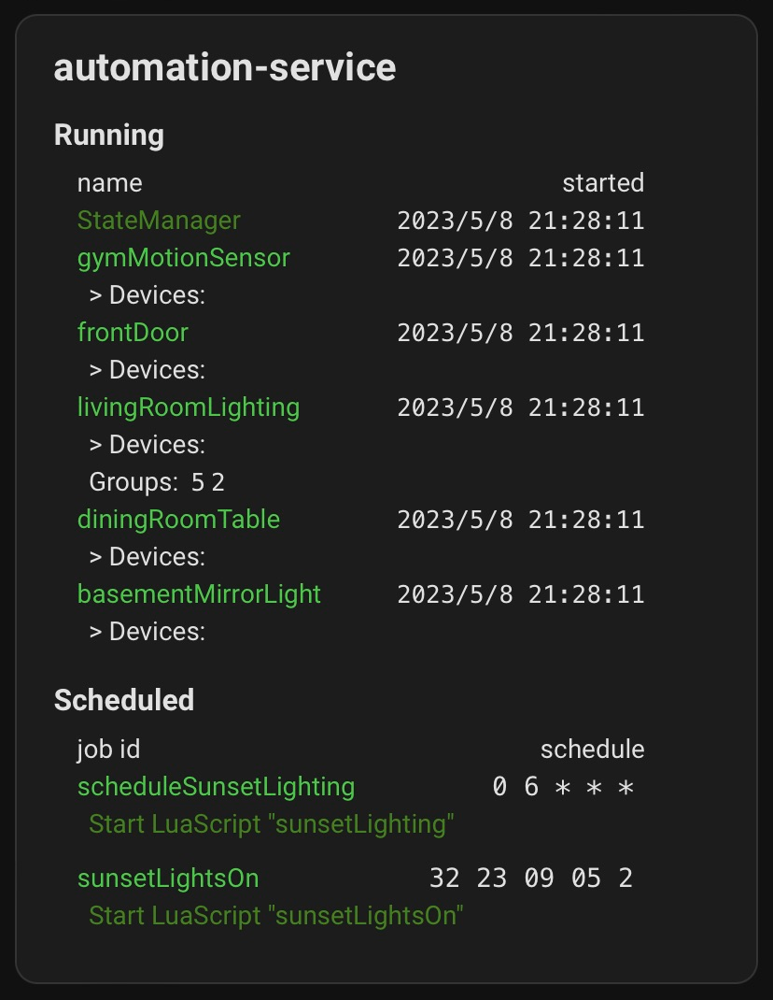

# automation-service

[](https://github.com/ddellacosta/automation-service/actions/workflows/main.yml)

[Test Runs](https://ddellacosta.github.io/automation-service/test-runs/)



automation-service is a tool for setting up simple-to-complicated home automations, like triggering lighting to go on when you enter a room, or reading from and responding to sensors--and much more. Its goals include:
  * allowing quick feedback loops for experimentation and testing
  * robustness, stability, efficiency
    * supporting open standards and interoperability
    * **being simple to understand and start using for home automation DIYers and makers**

It communicates via MQTT and can automatically pull and use device and group information from Zigbee2MQTT, but it can potentially be used with anything that can communicate over MQTT. It provides a simple message protocol for starting, stopping, and scheduling automations over MQTT, and lets you write automations in Lua with [batteries-included helpers](docs/lua_api.md) by dropping scripts in the `lua-automations` directory. There is a custom card available for showing status information (and more soon) in Home Assistant as well, seen in the above screenshot.

Right now this software is usable, but in an alpha state (see [issues](https://github.com/ddellacosta/automation-service/issues) for more).


## How It Works

Currently it is assumed you will be running automation-service in a container setup [as described below](#running). I'd like to figure out how to add it as an integration in Home Assistant soon as well.

In the root directory of your automation-service install (as configured in docker-compose), in the same location as the config.dhall file, place a directory called `lua-automations`--the easy way to set all of this up is to simply clone/copy the repo into place and tweak.

Any Lua scripts in the `lua-automations` directory will be available for running. Here is a basic example which flashes lights when a sensor is triggered and a specific condition is met:

```lua
frontDoorSensor = nil
frontDoorSensorChan = nil
basementMirrorLight = nil
livingRoomWindowLight = nil

function setup ()
   -- these IDs correspond to IEEE Addresses in Zigbee2MQTT
   frontDoorSensor = register("0x0015bc001e00f658")
   basementMirrorLight = register("0xb4e3f9fffe14c707")
   livingRoomWindowLight = register("0x680ae2fffe4577ac")
   frontDoorSensorChan = subscribe(frontDoorSensor.topic)
end

function loop ()
   resp = frontDoorSensorChan()

   if resp.contact == false then
      logDebugMsg("hey someone opened the door")
      publish(basementMirrorLight.topicSet, { effect = "blink" })
      publish(livingRoomWindowLight.topicSet, { effect = "blink" })
   end
end
```

You can start this by sending a "start" message to the topic "automation-service/set", e.g.:

```shell
> mosquitto_pub -u user -p password -t automation-service/set -m "{\"start\": \"frontDoor\"}"
```

A second "start" message will kill any running instances of the automation, and start it again (setup() will be run again). Similarly, you can stop a running automation using a "stop" message:


```shell
> mosquitto_pub -u user -p password -t automation-service/set -m "{\"stop\": \"frontDoor\"}"
```

You can schedule an automation to run with a message as well, using [cron](https://en.wikipedia.org/wiki/Cron#Overview) syntax:

```shell
> mosquitto_pub -u user -p password -t automation-service/set \
  -m "{\"schedule\": \"0 6 * * *\", \"job\": {\"start\": \"frontDoor\"}, \"jobId\": \"frontDoorJob\"}"
```

You can unschedule automation jobs with the jobId via "unschedule:"

```shell
> mosquitto_pub -u user -p password -t automation-service/set m "{\"unschedule\": \"frontDoorJob\"}"
```

If you use Home Assistant, you can send messages to MQTT topics via its developer console as well. These messages and more can also be sent by scripts, so scripts can start and schedule other scripts. See an example of this in [/lua-automations/sunsetLighting.lua](lua-automations/sunsetLighting.lua).

Check out other examples in the [/lua-automations/](/lua-automations/) directory, and see the current Lua API reference documentation [here](docs/lua_api.md).


## Configuration

automation-service itself is configured in the [config.dhall](/config.dhall) file.

The `mqttBroker`'s `uri` setting determines how automation-service is going to connect to the network's broker. See the default config for an example of connecting via SSL using a password. 

If you don't want to configure SSL set caCertPath, clientCertPath, and clientKeyPath to `None`.

### Home Assistant Custom Card

The Custom Card receives data from automation-service as a sensor (honestly not sure if this is hacky or the right way to do it lol). The configuration for this is at [homeassistant/config/configuration.yaml](homeassistant/config/configuration.yaml), and the custom card itself is at [homeassistant/config/www/automation-service-card.js](homeassistant/config/www/automation-service-card.js), which is where you want to put it in your own system, and load it as a resource to enable it (p.s. I am a super newbie at writing HA code, so I'd appreciate any pointers on what I may be doing wrong here).


## Running

Currently the automation-service docker image is built on every push to master, and [published to the Github container registry](https://github.com/ddellacosta/automation-service/pkgs/container/automation-service). You can run this in a docker-compose stack a la https://www.home-assistant.io/installation/linux#install-home-assistant-container:

```yaml
  automation-service:
    container_name: automation-service
    image: ghcr.io/ddellacosta/automation-service:latest
    restart: unless-stopped
    networks:
      - localnet
    volumes:
      - ./automation-service/:/app
    environment:
      - TZ=America/New_York
```


## Development

This project uses format via stylish-haskell. Credit to https://raw.githubusercontent.com/kowainik/org/main/.stylish-haskell.yaml for the base.

### Building locally

This requires [nix](https://nixos.org/download.html).

```shell
> nix build; docker load < result
# or with more verbose output

> nix build -v -L .
...
> docker load < result
0395990e5bd7: Loading layer [==================================================>]  5.847GB/5.847GB
Loaded image: automation-service:14j3qyc3fxwrlnj95c62c5frkb04hdv7

# can test via e.g.
# (starts up and fails as mqtt broker is not running ^)
> docker run --rm --log-driver=local -v ./config:/app/config -v ./lua-automations:/app/lua-automations -v ./logs:/app/logs -w /app automation-service:14j3qyc3fxwrlnj95c62c5frkb04hdv7
automation-service: Network.Socket.getAddrInfo (called with preferred socket type/protocol: AddrInfo {addrFlags = [AI_ADDRCONFIG], addrFamily = AF_UNSPEC, addrSocketType = Stream, addrProtocol = 0, addrAddress = 0.0.0.0:0, addrCanonName = Nothing}, host name: Just "mosquitto", service name: Just "8883"): does not exist (Name or service not known)

# or
> docker run --rm -it --entrypoint /bin/bash automation-service:14j3qyc3fxwrlnj95c62c5frkb04hdv7
bash-5.2# 

```

You can now take this and drop it in the `compose.yaml` in this directory.

```bash
#
# dumb smoke test to confirm that image works in context of default compose.yaml
#
`curl -o /dev/null -s http://localhost:8081/ -w %{response_code}` -eq 200 ] && echo "true" || exit 1
```

## Frontend

```shell
> cd ui
# this also copies mocha.js and mocha.css to ui/test/browser on postinstall
> npm install

# bundle spago into index.js
> spago bundle -p automation-service

# do the same but watch for files changing in src/
> watchexec -w src -- spago bundle -p automation-service

# generate css from scss
> cd css
> npx sass .

```


### Testing

Running main application test suite:

```shell
# watchexec is handy:
> watchexec -w test -w src -w app -i "*.db" -i "test/dbs/*" 'cabal test --test-show-details=always --test-options "--color=always --reporter=local"' # local reporter so we list each test result in the console vs. sending to an xml file.
> cabal test --test-show-details=always --test-options '--color=always -l -p Unit'
> cabal test --test-show-details=always --test-options '--color=always -l -p Integration'
```

Frontend tests:

```shell
watchexec -w src -w test/src -- "spago bundle -p automation-service-test; npx mocha-headless-chrome -t 60000 -e (which chromium) -a 'allow-file-access-from-files' -f test/browser/index.html"
```

#### Test Run Reporting - Allure Report

This project uses Allure Report for generating visual reports about test runs in Github Actions (see the `publish-reports` job in [.github/workflows/main.yml](https://github.com/ddellacosta/automation-service/blob/d46654fa28acbc9c024c149dc8e63b570612a6c6/.github/workflows/main.yml#L125) for details).

As part of the process to publish test run reports to Github Pages, the Haskell application in generate-allure-site is run. This application collects the branch test runs and lists all test run links in a single place, sorted by how recent runs were made in CI (https://ddellacosta.github.io/automation-service/test-runs/).

You can run this locally:

```shell
# assumes gh-pages branch is at ghp, as is set in Github Actions
> git clone --single-branch --branch gh-pages https://github.com/ddellacosta/automation-service ghp
> nix build -L .#allure-site-generator
> result/bin/generate-allure-site
# this also builds a utility for serving a static site
# it defaults to 8000 if you don't pass a port
> cd ghp; ../result/bin/serve 8080
```

There is more manual documentation about how allure report works with each test suite [here](/docs/allure_report.md).


## License/Copyright

GNU AGPLv3 License. Copyright © 2022-2023 Dave Della Costa, all rights otherwise reserved
